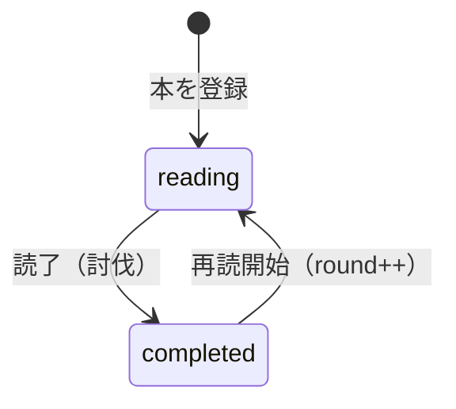

# 用語集

更新日: 2025-01-02

## ドメイン用語

### 本（ドラゴン）
積読本を敵キャラクターとして表現したもの。

| 属性 | ゲーム表現 | 説明 |
|------|-----------|------|
| ページ数 | HP | 本の総ページ数 |
| 既読ページ | ダメージ | 読んだページ数の累計 |
| 読了 | 討伐 | 最後まで読み終えた状態 |

### 読書（戦闘）
本を読む行為をゲームの戦闘として表現。

- **攻撃**: ページを読むこと
- **ダメージ**: 読んだページ数
- **討伐**: 本を読了すること

### 経験値（EXP）
読書によって獲得するポイント。スキルごとに蓄積される。

**計算式**:
- 基本: 1ページ = 1EXP
- 討伐ボーナス: +10%

詳細は [planning/exp-system.md](../planning/exp-system.md) を参照。

### スキル
本に紐づくカテゴリ。読書により経験値が貯まる。

例: プログラミング、デザイン、ビジネス、小説

### レベル
スキルごとの習熟度。経験値の累計から計算。

**計算式**: `必要経験値 = Lv^1.5 × 50`

### 周回（round）
同じ本を複数回読む場合のカウント。

## ステータス定義

### BookStatus（本の状態）

| ステータス | 意味 | 遷移条件 |
|-----------|------|---------|
| `reading` | 読書中 | 本を登録した初期状態 |
| `completed` | 討伐済み | currentPage >= totalPages |

## 技術用語（参考）

| 用語 | 説明 | 用途 |
|------|------|------|
| Hono | 軽量Webフレームワーク | APIサーバー |
| Cloudflare Workers | エッジランタイム | APIホスティング |
| DynamoDB | NoSQLデータベース | データ永続化 |
| Firebase Auth | 認証サービス | ユーザー認証 |
